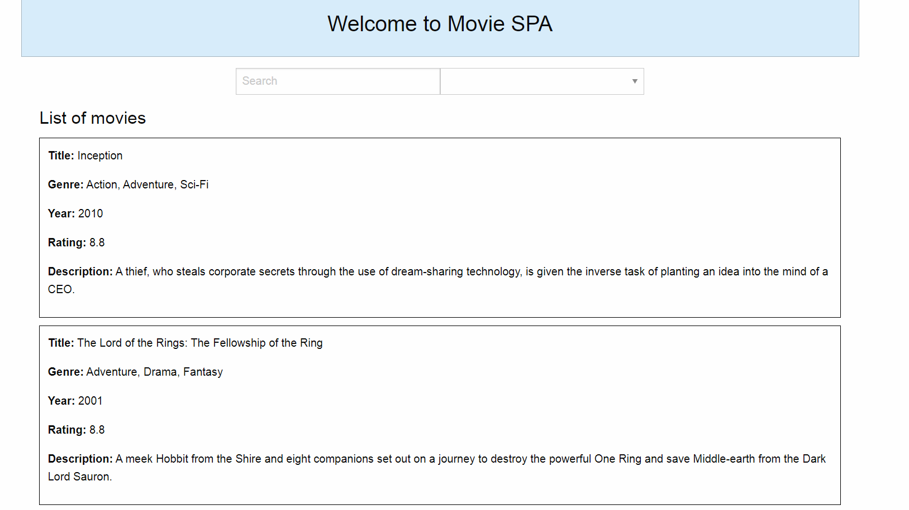

# MovieSpa

Simple Single Page Application
---
Stack of technologies : ASP.NET MVC, AngularJS, Foundation 6 CSS Framework

Subject: Movie database site
---

Data and business logic:
	1. Class Movie [id (int), title, description, rating (int), category id], Movies list and Category (id, name)
	2. Movies Repository class
		- method to return fixed (hard coded) list of movies
 		- method to return movie by id (from the hard coded list)
 	3. Movie service class:
		- list of movies (return list of movies from Repository class method)
 		- details of selected movie (return from movie repository by id)
 	4. MVC Controller for returning list of movies and movie details (using movie service class) in json format:
 		- API method to return list of movies
 		- API method to return movie details

 	5. Tests
 		- tests for movie service methods: list and movie details

